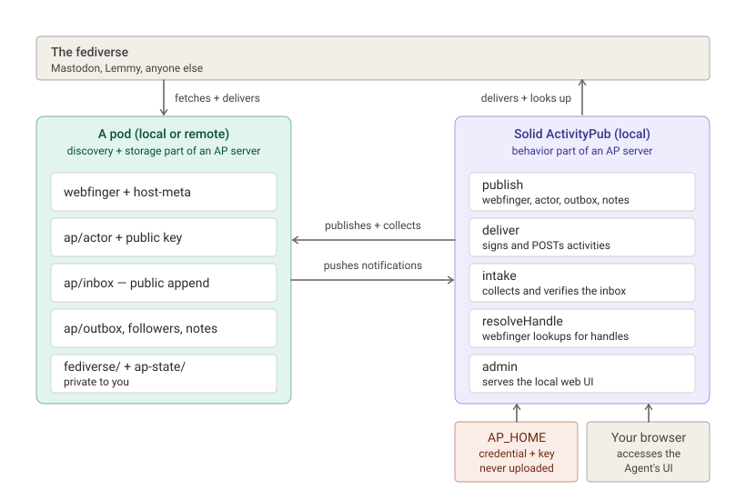

# FediPod

- access the fediverse from a Solid pod

`FediPod` is a standalone, single-user ActivityPub and ATProto agent that stores your public data on almost any subdomained Solid Pod and runs on any device that supports node >20. The agent can be moved from one device to another without any change to your account. There is support for fediverse group formation and management, see [Groups](groups.md).

This project is inspired by the fantastic [ActivityPods project](https://github.com/activitypods) and is meant to be a lightweight alternative rather than a replacement.

<!-- CLAUDE 2026-08-16 — jg10 acknowledgement, as approved; delete these markers when done -->
The client-to-server authentication approach and the fronted-identity idea — advertising an actor on one domain while its documents live on a pod — are borrowed from jg10's [solid-activitypub-netlify](https://github.com/jg10-mastodon-social/solid-activitypub-netlify), which showed that a pod-backed ActivityPub account could run serverless.
<!-- /CLAUDE -->


**Important** if you use `FediPod` to create a pod-based Fediverse account, posts will be sent to your pod until you use the park, retire, or transfer options to temporarily or permanently close your account.  If you are following lots of people, you'll need to start your local agent at least every few days to keep your pod from accumlating mail which is pulled off the pod while your agent is running.

## Requirements

* a web browser
* node 20 or greater
* a local or remote Solid pod that
  * supports subdomains and https
  * has a domain name
  * is almost always on

Note : if you don't have a pod account, setup will easily create one for you.

## Installation

In a terminal :

```
git clone https://github.com/jeff-zucker/FediPod;
cd FediPod;
npm install
```

## Setup

You only have to do setup once per device. Just run `npm start` from the project folder. From nothing — no fediverse account, no pod — one command creates the account, the pod, the actor, and leaves you in the client looking at your fediverse home with a pre-stocked home feed. Setup will prompt you for needed information. If you already have a pod, you'll be offered the opportunity to either create a new pod for your FediPod data or to store it on your existing pod.

### Running the agent

From the install folder, run `npm start`. You may optionally add a port number (`npm start 8081`) to change your local agent's port (default is 8030).

Now point your browser (any) at http://localhost:8030 — or your own port if you set one — and there you go!

### Running the agent as a service

If you don't want to run the agent each time, you can install it as a system service. This is recommended as leaving the agent off causes your mail to pile up on the pod host.  To create a system service :
```
npm run install-service
```
It registers every identity on this machine, one service each, so all of your actors start at boot. An identity running in a terminal is stopped and taken over by its service.

`npm run uninstall-service` reverses it. 

## Managing your FediPod install

You can manage your posts, see logs, park, move, transfer your account and perform other actions. See the [GUI admin](gui.md) and [CLI admin](cli.md) pages.

You can also use the admin tools to create other actors, either groups or persons.  You may have as many as you want on the local machine, but each one needs a separate pod.

<!-- CLAUDE 2026-08-16 — new: account migration into FediPod; rework/trim as you like, delete these markers when done -->
## Moving an existing fediverse account here

A Mastodon (or Pleroma, Akkoma, GoToSocial, Firefish, Misskey) account can be
moved to a FediPod identity with the fediverse's standard migration:

1. Set up your FediPod account, and on the admin page set **new followers** to
   *accepted automatically*.
2. Add your old account as a migration alias:
   `fedipod alias --add @you@old.server` (or the admin page's alias field).
3. On the old server, use its move-account option (on Mastodon: Preferences →
   Account → *Move to a different account*), naming your new address.

Your followers transfer by themselves. Your posts stay on the old server, and
the old profile redirects to the new one. The rest of the account comes over
from the old server's CSV export files:

```
fedipod import following_accounts.csv blocked_accounts.csv muted_accounts.csv lists.csv
```

which restores who you follow, your blocks, mutes and lists at a polite pace
and reports anything it could not resolve.

## A mail gateway (optional)

Most of what a fediverse inbox receives is broadcast noise. A gateway is a
shared, always-on door that verifies each delivery, drops the junk, and
passes the rest to your pod — while your name, key and data stay on your own
pod. Attach at a gateway's signup page (there is one at
[fedipod.net](https://fedipod.net/)): sign in with your pod to prove it's
yours, run the one `fedipod gateway … --inbox-only` command it hands you,
and restart your agent. `fedipod gateway --detach` undoes it with one
republish.
<!-- /CLAUDE -->

## Fediverse Clients

The UI is the bundled [Phanpy](https://github.com/cheeaun/phanpy)
client (MIT, by Chee Aun); patched to allow the loopback http origin. It is served same-origin over the agent's Mastodon client-API facade. Log in with one
click, using `localhost:8030` (or your own port) as the instance.

The agent federates for real: follow/unfollow, post, reply, favourite,
boost, media, delete; incoming boosts from people you follow and a
configurable public-hashtag feed (`POST /tagfeed`) fill the timeline.
Also: editing posts, content warnings, polls and voting, all four visibility
levels (followers-only and direct posts work only on a pod that enforces
access control — on one that doesn't, the composer refuses and says why),
a conversations view for direct messages, bookmarks, favourites, lists,
keyword filters, scheduled posts, pinned posts (visible from other servers),
blocking and muting from the client, custom emojis, and web-push
notifications that reach you while the client is closed.


### Other clients

- **Web clients**: drop any static Mastodon client dist into `ui/<name>/`
  and it is served at `/<name>/`, same-origin — see `ui/README.md`.
- **Desktop clients** (Tuba, Whalebird, …): add `http://localhost:8030` (or other port for other agent) as a
  custom instance.
<!-- CLAUDE 2026-08-17 — https for clients that refuse plain http; rework/trim as you like, delete markers when done -->
- **Clients that require https** (most phone apps, and any client that
  rejects a plain-http instance): use `https://localhost:9030` — every agent
  serves https on its port plus 1000, with a certificate made on your
  machine at first start. Your client may ask once to trust it; if it
  refuses self-signed certificates outright, run `fedipod https --trust`
  and follow the printed step to add the local CA to your trust store.
<!-- /CLAUDE -->
- **Streaming**: the agent serves the Mastodon streaming API
  (`/api/v1/streaming`, WebSocket) so clients update live instead of polling.

## Bluesky and ATProto

`FediPod` includes experimental support for ATProto. A Bluesky connection lets your `FediPod` agent drive an existing Bluesky (or other ATProto) account alongside your fediverse identity. When you post a public post from `FediPod`, it will be cross-posted to Bluesky as a mirror (a toggle you can turn off). Private DMs from `FediPod` to Bluesky are not currently supported.  Bluesky replies and activity flow into your timeline so you see, for example, a combined Bluesky and Mastodon feed.  You can like, boost, and reply to Bluesky posts from within `FediPod`.  None of these features require `Bridgy Fed`, however, fully joining a `FediPod` group from a Bluesky client other than `FediPod` does require a bridge.


## Architecture

`Activitypods` requires a server which provides both an ActivityPub server and a Solid server and thus requires a specific server setup.  `FediPod`, on the other hand, can be installed on any subdomained https-served pod.  It does this by splitting the ActivityPub server into two parts.  The pod part provides discovery (webfinger) and stores mostly public data while the local server provides the ActivityPub actions and storage for most private data. The exception is private direct messages which are stored on the pod protected by ACL resources.



<!-- CLAUDE 2026-08-11 — new since the last README; rework/trim as you like, delete these markers when done -->
### Protocol conformance

FediPod is a full ActivityPub server, on both of the spec's profiles:
server-to-server (§7) and client-to-server (§6) — `POST /ap/outbox` on the
agent takes a signed activity (or a bare Note) and does the id-minting,
side-effects and delivery, authenticated by a Solid-OIDC token whose WebID is
the owner's. The Mastodon REST API is the everyday client interface; C2S is
the spec's own.

Group actors follow FEP-1b12: a carried post names the group as its
`audience`, the moderator roster is published as the actor's `attributedTo`,
a followed group's announced `Delete` of a post it carried is honoured, and
the group's own moderation is announced to the membership. The FEP-4ccd
pending-follow collections and the FEP-c648 blocked collection are published
as owner-only documents. See [Groups](groups.md).
<!-- /CLAUDE -->

## Transparency

This package was created using a heavily hectored claude.

## License

(c) Jeff Zucker, 2026; may be freely used with an MIT license.
