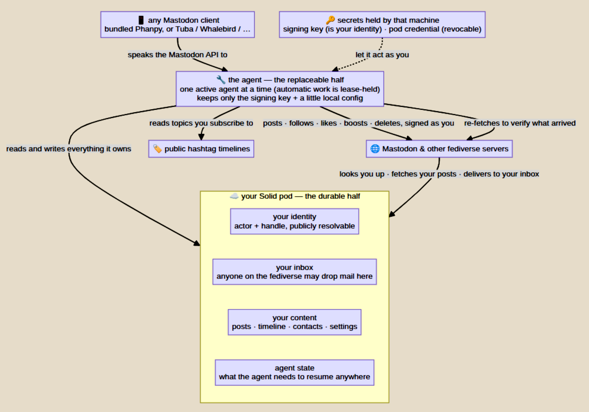

# activitypod-js

- access the fediverse from a Solid pod

`activitypod-js` is a standalone, single-actor ActivityPub agent that stores your data on a Solid Pod and runs on any device that supports node. The agent can be moved from one device to another without any change to your account. This project is inspired by the fantastic [Activitypods project](https://github.com/activitypods) and is meant to be a light weight alternative rather than a replacement.

<!-- CLAUDE 2026-07-30 — added; drop it if the Groups section below is enough -->
That actor can be a person or a [group](#groups) — a group lives on its own pod
and carries its members' posts to everyone following it.
<!-- /CLAUDE -->

## Installation

In a terminal :

```
git clone https://github.com/jeff-zucker/activitypod-js;
cd activitypod-js;
npm install
```

## Setup

You only have to do setup once per device. From nothing — no fediverse account, no pod — one command creates the account, the pod, the actor, and leaves you in the client looking at your fediverse home with a pre-stocked home feed. Setup will prompt you for needed information. If you already have a pod, you'll be offered the opportunity to either create a new pod for your Activitypod data or to store it on your existing pod.

```
bin/activitypod.mjs setup
```

### Running the agent

From the install folder, run `bin/activitypod.mjs start`.
You may optionally add `--port PORTNUM` to change your local agent's port (default is 8030), or `--name "Your Name"` to change the display name other people see.

Now point your browser (any) at http://localhost:8030 — or your own `--port` if you set it — and there you go!


### Running the agent as a service

If you don't want to run the agent each time, you can install it as a system sevice :
```
bin/activitypod.mjs install-service
```
This registers the agent with systemd (Linux) or launchd
(macOS) so it starts at boot, restarts on crash, and needs no terminal.
`uninstall-service` reverses it. 

On **Windows** it creates a Scheduled Task that starts the agent at log on (this path is untested — it prints the equivalent `schtasks` command either way). On **Android/Termux** there is no service manager, so it prints a boot-script recipe using the Termux:Boot app and `termux-wake-lock` instead; whatever Android kills is buffered on the pod and catches up at the next start.

### Starting and Stopping the agent

```
bin/activitypod.mjs start    # start (setup already did this the first time)
bin/activitypod.mjs stop     # graceful: flushes state, releases the lease
bin/activitypod.mjs status   # handle, active/viewer mode, followers, tag feed
```

Two more when you need them:

```
bin/activitypod.mjs tokens                  # list client logins; --revoke <prefix> / --revoke-all
bin/activitypod.mjs revoke-credential --email you@example.org   # kill this machine's pod credential
```


<!-- CLAUDE 2026-07-30 — new section; reword freely, delete these two comment lines when done -->
## Groups

A group is an actor other people follow, rather than one that follows people.
Post to it and it re-announces to everyone following it, so members see each
other without having to follow each other. Joining is following, leaving is
unfollowing, and remote Mastodon users can join exactly as pod owners do — they
need no pod of their own.

A group needs a pod of its own. A handle is answered at the root of its host, so
a person and a group cannot share one pod without fighting over the same address:

```
bin/activitypod.mjs setup --group --profile mygroup --new-account
```

Run it like any other identity — `start`, `stop`, `status`, `park`, `retire` —
on its own port. It serves no client UI, because there is no timeline for a
human to read, which also means it has no login and no client tokens.

Only members are amplified. Anyone can post into a public inbox, so a post is
carried only when its author already follows the group. That is both the
anti-spam rule and what makes joining mean something.

```
bin/activitypod.mjs members                 # who has joined
bin/activitypod.mjs announced               # what the group has carried
bin/activitypod.mjs mute <actor-url>        # stop carrying someone (undo: unmute)
bin/activitypod.mjs eject <actor-url>       # remove them, and tell their server
bin/activitypod.mjs retract <note-url>      # unsay something already carried
bin/activitypod.mjs review on               # hold every post until you approve it
bin/activitypod.mjs pending                 # what is waiting; approve / decline
```

A group can be handed on rather than abandoned: `retire --move-to <actor>` tells
every follower to migrate, so the membership survives a change of host.
<!-- /CLAUDE -->

## Fediverse Clients
The UI is the bundled [Phanpy](https://github.com/cheeaun/phanpy)
client (MIT, by Chee Aun); patched to allow the loopback http origin. It is served same-origin over the agent's Mastodon client-API facade. Log in with one
click, using `localhost:8030` (or your own `--port`) as the instance.

The agent federates for real: follow/unfollow, post, reply, favourite,
boost, media, delete; incoming boosts from people you follow and a
configurable public-hashtag feed (`POST /tagfeed`) fill the timeline.

### Other clients

- **Web clients**: drop any static Mastodon client dist into `ui/<name>/`
  and it is served at `/<name>/`, same-origin — see `ui/README.md`.
- **Desktop clients** (Tuba, Whalebird, …): add `http://localhost:8030` as a
  custom instance.
- **Streaming**: the agent serves the Mastodon streaming API
  (`/api/v1/streaming`, WebSocket) so clients update live instead of polling.

## Android

The agent is pure JS, so [Termux](https://termux.dev) runs it unmodified:

```
bin/activitypod.mjs start      # then open http://localhost:8030/ 
```

`termux-wake-lock` keeps it alive in the background; and because the pod
buffers everything, an agent Android kills simply catches up on next start.

## Requirements

* a web browser
* node 20 or greater
* a Solid pod provider that supports subdomains

## Architecture



## Transparency

This package was created using a heavily hectored claude.

## License

(c) Jeff Zucker, 2026; may be freely used with an MIT license.
