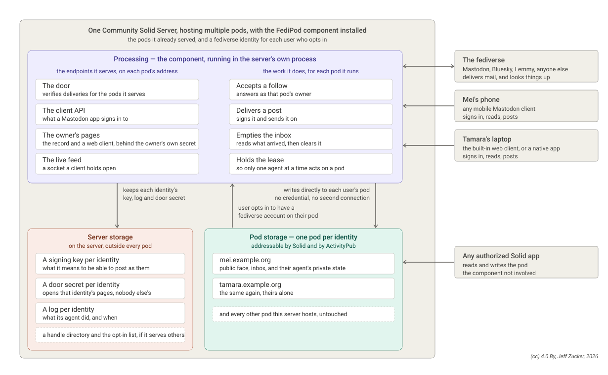

# FediPod Server

-- a full ActivityPub server deployed as a Community Solid Server component

This is a CSS component. Install it in a server you already run for pods, and
name a pod: the component runs the whole FediPod agent for it, so the pod
accepts follows, delivers posts, drains its inbox and serves its owner's
Mastodon client on the pod's own origin. There is no agent process to keep
alive, and everything reaches the pod through the server's own store — no
credential, no second box, no loopback request.

With nothing configured beyond the defaults, installing the component changes
nothing about how the server serves pods.



## Install

```
npm install fedipod-server
```

Add the package context to your CSS config and import the shipped snippet:

```json
{
  "@context": [
    "...your CSS context...",
    "https://linkedsoftwaredependencies.org/bundles/npm/fedipod-server/^0.0.0/components/context.jsonld"
  ],
  "import": [
    "css:config/default.json",
    "fps:config/server.json"
  ]
}
```

Then set what you need on the `urn:fedipod:server:Handler` node and restart
the server. The snippet places the component in the routing waterfall ahead of
the LDP catch-all, on the initializer and finalizer lists so identities start
and stop with the server, and on the websocket handler list for the live feed.

## Acting for pods you host

Name the pods, and each becomes a fediverse identity:

```json
{
  "@id": "urn:fedipod:server:Handler",
  "@type": "FediPodServerHandler",
  "args_agentPods": [ "https://mei.example.org/" ],
  "args_agentDataDir": "/var/lib/css/fedipod-agent/"
}
```

An identity that does not exist yet is provisioned when the server starts: its
name is the pod's subdomain label, and it publishes an actor, a signing key and
WebFinger on the pod itself. Its state lives on the pod. Its signing key lives
in `agentDataDir`, one directory per identity — and beside it,
`door-secret.json`: the secret guarding that identity's own pages. Each
identity has its own; one owner's secret opens nobody else's door. The boot
log names each file, and reading it is how the operator learns a secret. The
log never contains the secret itself.

| Setting | What it is |
|---|---|
| `agentPods` | Pod base URLs to run an identity for. Listing a pod is how you turn this on; with none, nothing runs. |
| `agentDataDir` | Where each identity keeps its signing key, log, and door secret. Required whenever an agent is enabled. |
| `agentUiPath` | Where the owner's pages live on the pod's origin. `/app/` by default; empty serves no pages. |
| `agentRuntimeOptIn` | Whether a pod owner may opt in at runtime by proving control of their pod. Off unless the host chooses it. |
| `agentRegistryContainer` | The internal container holding runtime opt-in rows. |
| `runPage` | The HTML served at `/run`: the page where a pod owner opts in or out. The repo ships one at `web/front/run.html`. |
| `agentWebIdSuffix` | Path from a pod's base to its owner's WebID. Defaults to `profile/card#me`. |
| `agentPollSeconds` | How often the inbox is swept. Deliveries also wake the sweep as they land, so this is the fallback. |
| `agentAutoAcceptFollows` | Whether a newly provisioned identity accepts follows without review. On by default. |

### The pod is the instance

Each identity answers on its pod's origin, so the pod is what a client
connects to. Point a Mastodon app at `https://mei.example.org/` and it finds
what it expects: nodeinfo, the client API under `/api/`, sign-in under
`/oauth/`, the live feed at `/api/v1/streaming`, and the ActivityPub write API
at `/ap/outbox`. The owner's own pages — the record, the setup screens and the
bundled web client — are behind `agentUiPath`, which the door secret guards.

The client API answers any origin, the way any Mastodon server does, so a
browser client works too: it registers an app, and the authorize screen names
what is asking and where the code will be sent before the owner approves it
with the password. The authorization code is bound to the client's registered
redirect, and only that client, holding its secret, can exchange it for a
token.

A client API is rooted at an origin, so each identity needs an origin of its
own: subdomain pods, one per identity. Two entries on one host are refused
when the server starts rather than half-working.

### Before you turn it on

**The server holds the keys.** Whoever runs the server can act as the
identities it runs. For a self-hoster that is their own machine either way;
for anyone hosting other people, it is a promise being made to them.

**Sign-in needs a password.** These routes face the whole internet, so
`/oauth/authorize` refuses until the identity has one. Set it once through the
owner's door, with that identity's own door secret:

```
curl -X POST https://mei.example.org/app/config \
  -H 'x-dk-token: THE_DOOR_SECRET_FROM_door-secret.json' -H 'content-type: application/json' \
  -d '{"password":"the one you will type into your phone"}'
```

**Some pod paths stop being served.** On an identity's origin the paths above
belong to the identity, so pod resources at those names — a container called
`api`, `oauth` or `app`, or documents at `ap/actor`, `ap/outbox`,
`.well-known/nodeinfo` and `nodeinfo/2.0` — are not served over HTTP there.
They stay in the pod and in its listings. Every other path is the pod, exactly
as before. The server logs the list for each identity when it starts.

**Run one worker.** A delivery is picked up the moment it lands only in a
single-worker server. With `--workers` above one the inbox is swept on the
timer instead, and the server says so at startup. Runtime opt-in requires a
single worker outright, and says so when refused.

## Letting pod owners opt in themselves

With `agentRuntimeOptIn` on, a pod owner can ask the server to run their
identity without the operator touching the configuration. Point owners at the
`/run` page (supply `runPage`): they sign in with their pod there and opt in
or out. Underneath it is one endpoint:

```
POST /api/agent
{"action": "opt-in", "podBase": "https://mei.example.org/"}
```

The request carries a Solid-OIDC token; the WebID it proves must live under
the pod being claimed. The reply carries the identity's door secret, shown
that once and never again — losing it is not fatal, because opting in again
mints a fresh one and retires the old, with no restart and no dropped
connections. `{"action": "opt-out"}` stops the identity and returns the pod
to plain pod serving; deliveries keep landing in its inbox and simply wait.
Opted-in pods are recorded in the registry container and come back after a
server restart — which is also why runtime opt-in wants a persistent storage
backend: rows kept in a memory backend vanish when the server stops.

Pods listed in `agentPods` cannot opt out over the wire (the configuration
would bring them back), but their owners may opt in to rotate a lost door
secret.

## What is in the package

| File | What it does |
|---|---|
| `src/handler.ts` | The HTTP handler, and the identities' lifecycle. Claims each identity's routes; everything else falls through to the server. |
| `src/streaming-handler.ts` | The live feed. Websocket upgrades never enter the request waterfall, so they arrive here. |
| `src/claims.ts` | Which paths belong to an identity. |
| `src/store-pod.ts` | An identity's whole conversation with its pod, carried by the server's store instead of the network. |
| `src/store-css.ts` | The component's own reads and writes, likewise. |
| `src/directory.ts` | The handle-to-pod directory, one document per handle. |
| `src/adapt.ts` | Node request and response to the WHATWG pair the shared core speaks. |

Writing through the store bypasses access control by design: the component is
the thing that decided the write is legitimate — a verified delivery, or an
identity acting on its own pod.

The agent is FediPod's own, unchanged: this package is the part that knows
about CSS.

## Build and test

TypeScript, built the way CSS builds its own components.

```
npm install
npm run build       # tsc → dist, then componentsjs-generator → dist/components
npm test            # unit tests, plus the transport against a real CSS store
npm run test:e2e    # boots a real server and uses it as a client would
```

`npm test` drives a genuine CSS store stack — ETags, conditional writes,
container listings — through the transport an identity uses, and checks the
lease protocol and the deletion deny-list still hold across it.

`npm run test:e2e` starts a real Community Solid Server with two pods, waits
for both to become identities, then signs in as a phone app does, posts,
receives a follow from another server, and watches the live feed. It takes
about a minute. `FEDIPOD_E2E_LOG=info` shows the server's log while it runs.

`dist/` and `node_modules/` are gitignored; `src/`, `config/` and this file are
the sources.
