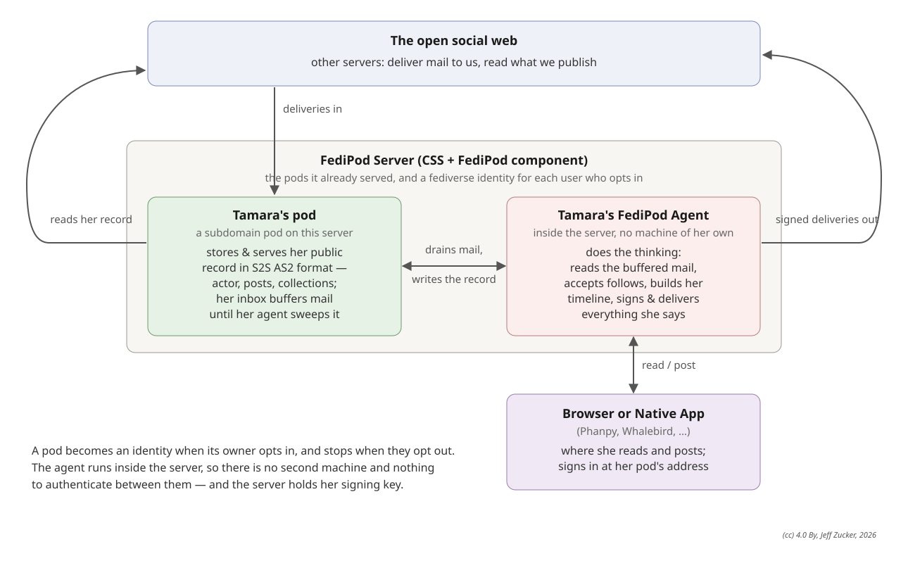

# FediPod Server

-- a full ActivityPub server deployed as a Community Solid Server component

This is a CSS component. Install it in a fresh server instance or an instance
you already run for pods, and turn sign-up on. A pod owner signs in at the
server's `/run` page and opts in; from then on their pod is a full fediverse
account: it accepts follows, delivers their posts, and serves their Mastodon
client at the pod's own address. Signing up is the only way an account is
made, and opting out is the only way one ends.

With nothing configured beyond the defaults, installing the component changes
nothing about how the server serves pods.



## Install

```
npm install fedipod-server
```

Add the package context to your CSS config and import the shipped snippet:

```json
{
  "@context": [
    "...your CSS context...",
    "https://linkedsoftwaredependencies.org/bundles/npm/fedipod-server/^0.0.0/components/context.jsonld"
  ],
  "import": [
    "css:config/default.json",
    "fps:config/server.json"
  ]
}
```

Then set what you need on the `urn:fedipod:server:Handler` node and restart
the server.
<!-- CLAUDE 2026-08-19 — the CSS config that fits; delete markers when done -->
Use a subdomain-pods CSS config: identities need an origin of their own, and
a path-pod config cannot opt anyone in.
<!-- /CLAUDE --> The snippet places the component in the routing waterfall ahead of
the LDP catch-all, on the initializer and finalizer lists so identities start
and stop with the server, and on the websocket handler list for the live feed.

## Turning sign-up on

```json
{
  "@id": "urn:fedipod:server:Handler",
  "@type": "FediPodServerHandler",
  "args_agentRuntimeOptIn": true,
  "args_agentDataDir": "/var/lib/css/fedipod-agent/"
}
```

An identity is provisioned when its owner opts in: its name is the pod's
subdomain label, and it publishes an actor, a signing key and WebFinger on the
pod itself. Its state lives on the pod. Its signing key lives in
`agentDataDir`, one directory per identity — and beside it,
`door-secret.json`: the secret guarding that identity's own pages. Each
identity has its own; one owner's secret opens nobody else's door.

<!-- CLAUDE 2026-08-19 — agentDataDir row: was "signing key, log, and door secret"; identity logs go to the server's own log. A comment inside the cell would break the table, so the marker sits here. Delete when reviewed -->
| Setting | What it is |
|---|---|
| `agentRuntimeOptIn` | Whether pod owners can sign up. With it off, nothing runs. |
| `agentDataDir` | Where each identity keeps its signing key, credential and door secret; its log lines go to the server's own log. Required whenever sign-up is on. |
| `agentUiPath` | Where the owner's pages live on the pod's origin. `/fedipod/` by default; empty serves no pages. |
| `agentRegistryContainer` | The internal container holding the sign-up rows. |
| `runPage` | The HTML served at `/run`: the page where a pod owner opts in or out. The package's own `web/front/run.html` is served unless you set this. |
| `agentWebIdSuffix` | Path from a pod's base to its owner's WebID. Defaults to `profile/card#me`. |
| `agentPollSeconds` | How often the inbox is swept. Deliveries also wake the sweep as they land, so this is the fallback. |
| `agentAutoAcceptFollows` | Whether a newly provisioned identity accepts follows without review. On by default. |

<!-- CLAUDE 2026-08-19 — settings the table above is missing; delete markers when done -->
| Setting | What it is |
|---|---|
| `frontHost` | The apex host the shared front answers on. The shipped snippet carries `fedipod.net`; set your own apex, or sign-up never routes. |
| `frontOrigin` | Its origin. |
| `directoryContainer` | The internal container holding the handle directory. |
| `agentAutoFront` | Whether every identity that starts also gets a `@handle@frontHost` address — an inbox-only directory row, written once. Off by default. |
| `offersPods` | Whether the signup page offers to create pods here. |
| `signupPage` | The signup page served at `/`, `/signup` and `/new-account`. The package's own is served unless you set this. |
| `gatewayWebId` | The WebID stamped on verification receipts. |

`signupPage` and `runPage` are the page's HTML itself, not a path to a file.
<!-- /CLAUDE -->

### The pod is the instance

Each identity answers on its pod's origin, so the pod is what a client
connects to. Point a Mastodon app at `https://mei.example.org/` and it finds
what it expects: nodeinfo, the client API under `/api/`, sign-in under
`/oauth/`, the live feed at `/api/v1/streaming`, and the ActivityPub write API
at `/ap/outbox`. The owner's own pages — the record<!-- CLAUDE 2026-08-19 — dropped "the setup screens": they are not served here; a server-hosted identity provisions itself from the opt-in --> and, in a repository
checkout, the bundled web client — are behind `agentUiPath`, which the door
secret guards.<!-- CLAUDE 2026-08-20 — the published package does not carry phanpy/dist, so the client 404s after `npm install` --> The published package does not carry the web client; point a
Mastodon app at the pod instead.<!-- /CLAUDE -->

The client API answers any origin, the way any Mastodon server does, so a
browser client works too: it registers an app, and the authorize screen names
what is asking and where the code will be sent before the owner approves it
with the password. The authorization code is bound to the client's registered
redirect, and only that client, holding its secret, can exchange it for a
token.

A client API is rooted at an origin, so each identity needs an origin of its
own: subdomain pods, one per identity. <!-- CLAUDE 2026-08-19 — was "refused when the server starts" -->A second identity on a host is
refused at opt-in<!-- /CLAUDE --> rather than half-working.

### Before you turn it on

**The server holds the keys.** Whoever runs the server can act as the
identities it runs. For a self-hoster that is their own machine either way;
for anyone hosting other people, it is a promise being made to them.

**Sign-in needs a password.** These routes face the whole internet, so
`/oauth/authorize` refuses until the identity has one. Set it once through the
owner's door, with that identity's own door secret:

```
curl -X POST https://mei.example.org/fedipod/config \
  -H 'x-dk-token: THE_DOOR_SECRET_FROM_door-secret.json' -H 'content-type: application/json' \
  -d '{"password":"the one you will type into your phone"}'
```

**Some pod paths stop being served.** On an identity's origin the paths above
belong to the identity, so pod resources at those names — a container called
`api`, `oauth` or `fedipod`, or documents at `ap/actor`, `ap/outbox`,
`.well-known/nodeinfo` and `nodeinfo/2.0` — are not served over HTTP there.
They stay in the pod and in its listings. Every other path is the pod, exactly
as before.<!-- CLAUDE 2026-08-19 — dropped "The server logs the list for each identity when it starts.": it does not -->

**Run one worker.** A delivery is picked up the moment it lands only in a
single-worker server. With `--workers` above one the inbox is swept on the
timer instead, and the server says so at startup. Sign-up requires a
single worker outright, and says so when refused.

## How sign-up works

A pod owner opens the `/run` page, signs in with their pod,
and opts in or out. Underneath it is one endpoint:

```
POST /api/agent
{"action": "opt-in", "podBase": "https://mei.example.org/"}
```

The request carries a Solid-OIDC token; the WebID it proves must live under
the pod being claimed. The reply carries the identity's door secret, shown
that once and never again — losing it is not fatal, because opting in again
mints a fresh one and retires the old, with no restart and no dropped
connections. <!-- CLAUDE 2026-08-19 — the full opt-out call -->`{"action": "opt-out", "podBase": "https://mei.example.org/"}`,
with the same token as opt-in,<!-- /CLAUDE --> stops the identity and returns the pod
to plain pod serving; deliveries keep landing in its inbox and simply wait.
Opted-in pods are recorded in the registry container and come back after a
server restart — which is also why sign-up wants a persistent storage
backend: rows kept in a memory backend vanish when the server stops.

## What is in the package

| File | What it does |
|---|---|
| `src/handler.ts` | The HTTP handler, and the identities' lifecycle. Claims each identity's routes; everything else falls through to the server. |
| `src/streaming-handler.ts` | The live feed. Websocket upgrades never enter the request waterfall, so they arrive here. |
| `src/claims.ts` | Which paths belong to an identity. |
| `src/store-pod.ts` | An identity's whole conversation with its pod, carried by the server's store instead of the network. |
| `src/store-css.ts` | The component's own reads and writes, likewise. |
| `src/directory.ts` | The handle-to-pod directory, one document per handle. |
| `src/adapt.ts` | Node request and response to the WHATWG pair the shared core speaks. |

Writing through the store bypasses access control by design: the component is
the thing that decided the write is legitimate — a verified delivery, or an
identity acting on its own pod.

The agent is FediPod's own, unchanged: this package is the part that knows
about CSS.

## Build and test

TypeScript, built the way CSS builds its own components.

```
npm install
npm run build       # tsc → dist, then componentsjs-generator → dist/components
npm test            # unit tests, plus the transport against a real CSS store
npm run test:e2e    # boots a real server and uses it as a client would
```

`npm test` drives a genuine CSS store stack — ETags, conditional writes,
container listings — through the transport an identity uses, and checks the
lease protocol and the deletion deny-list still hold across it.

`npm run test:e2e` starts a real Community Solid Server with <!-- CLAUDE 2026-08-19 — was "two pods": a third exercises runtime opt-in and opt-out -->three pods (two
become identities up front; the third opts in and out at runtime)<!-- /CLAUDE -->, then signs in as a phone app does, posts,
receives a follow from another server, and watches the live feed. It takes
about a minute. `FEDIPOD_E2E_LOG=info` shows the server's log while it runs.

`dist/` and `node_modules/` are gitignored; `src/`, `config/` and this file are
the sources.
